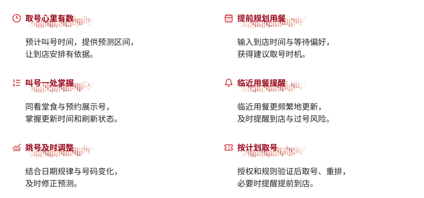

<h1 align="center">
  <picture>
    <source media="(prefers-color-scheme: dark)" srcset="assets/sushiwait-logo-dark.svg">
    
  </picture>
</h1>

<strong>少一点盯号，多一点自由安排。</strong>

想吃寿司，却不知道该几点取号、还要等多久、会不会突然过号？SUSHIWAIT 希望把这些不确定，变成有依据的用餐计划：结合寿司郎小程序的实时排队数据、历史规律和日期差异，帮助你安排取号与到店时间，把时间留给自己喜欢的事。

这是面向中国大陆寿司郎门店的独立开源项目。**目前处于实时接入验收阶段：已有三店持续采集与到期保护的实证，最新又走通电脑正常查询取得新凭证、退出小程序后独立查询三店的链路，无需手机抓包或导出 HAR。跨到期恢复仍待实测，预测模型、用户小程序和自动排队继续按阶段推进。**

## 产品与模型功能

### 当前可以做什么

- <strong><picture><source media="(prefers-color-scheme: dark)" srcset="assets/readme-labels/92b0a238e878b9e3-dark.svg"></picture></strong>：从官方微信小程序确认实际查询地址，电脑已独立读取中关村、西单、成都世豪的堂食、预约展示队列。用户退出小程序后，后续电脑查询仍成功；完整保留号码、顺序和后缀。

- <strong><picture><source media="(prefers-color-scheme: dark)" srcset="assets/readme-labels/bb36ec0d24eb180b-dark.svg"></picture></strong>：目录接口已通过电脑查询，返回 147 条门店记录。保留三店 60 秒和 30 秒的短窗结果，保留 30 秒各 67 轮、主库 219 份成功快照的历史结果；最新新凭证三店独立验证成功，另库西单持续采集进行中。全天稳定访问与全国完整覆盖仍待验证。

- <strong><picture><source media="(prefers-color-scheme: dark)" srcset="assets/readme-labels/9660e24eddc316c0-dark.svg"></picture></strong>：直接检查本机私有配置的到期声明、剩余时长与更新版本，显示是否触发到期前保护；不输出凭证内容。已观察到正常初始化返回新凭证，独立自动更新仍在验证中。

- <strong><picture><source media="(prefers-color-scheme: dark)" srcset="assets/readme-labels/c886e589de78387b-dark.svg"></picture></strong>：可离线检查本人导出的捕获文件，明确选择正常单店请求，将完整上下文写入私有配置。到期或临近到期时拒绝导入；此功能不自动登录或续期。

- <strong><picture><source media="(prefers-color-scheme: dark)" srcset="assets/readme-labels/18e6edb814fdbffe-dark.svg"></picture></strong>：保留同电脑响应接收与安全诊断，新增正常目录查询的短时摘要接入工具。目录来源已实测取得完整新凭证，关闭小程序后电脑查询三店成功，无需导出 HAR；正式命令、重复可靠性、跨到期和自动更新继续验证。

- <strong><picture><source media="(prefers-color-scheme: dark)" srcset="assets/readme-labels/115f5d28279edda3-dark.svg"></picture></strong>：在声明到期前 30 秒保护停采；可选择短时等待正常新凭证，通过检查后继续采集，并保持请求节奏。已实测保护暂停和等待超时停止；无需重启的恢复通过合成检查，真实恢复和独立自动续期仍待验证。

- <strong><picture><source media="(prefers-color-scheme: dark)" srcset="assets/readme-labels/139eaa95f99193d3-dark.svg"></picture></strong>：使用 SQLite 保存公共快照，隔离新旧接口及真实、合成数据；保留字段缺失情况，支持历史变化与采集质量报告。

- <strong><picture><source media="(prefers-color-scheme: dark)" srcset="assets/readme-labels/bf4fbb34b32ed56d-dark.svg"></picture></strong>：报告区分请求失败、字段处理失败与本机停采，统计实际请求间隔、展示号码变化和字段状态。明确统计窗口，帮助发现异常；相同数据不会被当成刚更新的数据。

- <strong><picture><source media="(prefers-color-scheme: dark)" srcset="assets/readme-labels/fce6b943bcea13b8-dark.svg"></picture></strong>：按指定历史时刻分析两分钟或更长窗口，比较前后两段展示集合的变化速率；遇到失败、缺口和时间逆序会断开比较，资料不足会明确显示。为异常检测准备可观察指标，尚不判断真实过号人数或触发提醒。

- <strong><picture><source media="(prefers-color-scheme: dark)" srcset="assets/readme-labels/65105f86981488eb-dark.svg"></picture></strong>：已核对堂食与预约展示数组，以及“已签到等待桌数”的客户端字段绑定；同屏桌数仍待对照。页面更新时间与门店源时间分开解释，避免把刷新动作当作数据刚刚更新。

- <strong><picture><source media="(prefers-color-scheme: dark)" srcset="assets/readme-labels/d0c5c2c9d3a688e2-dark.svg"></picture></strong>：本机可以校验和保存自己记录的取号、签到、叫号、过号、取消与入座结果，保留不确定时间范围和完整修订历史。人工记录与合成样例分别统计；真实性和训练资格还需审核，当前没有据此发布误差或预测。

- <strong><picture><source media="(prefers-color-scheme: dark)" srcset="assets/readme-labels/62455254a15761ec-dark.svg"></picture></strong>：离线识别 2026 年普通工作日、普通周末、节假日与调休上班日，保留星期、月份和日历季节。历史回放会核对公告当时是否已发布，其他年份保留未知，为后续预测准备可靠日期依据。

- <strong><picture><source media="(prefers-color-scheme: dark)" srcset="assets/readme-labels/5d2490ac8d59802b-dark.svg"></picture></strong>：提供合成回放、343 项本机代码检查、安装包验证及 GitHub 离线检查流程，覆盖号码保存、错误处理、来源隔离和旧数据库兼容；自动检查结果与真实接口验收分别记录。

真实跨到期恢复、部分字段单位、门店源时间、允许长期频率和全国覆盖仍未验收。目前的工具用于接入验证，预测能力尚未开放；有限展示号码的变化不会被当成真实过号率。

### 正在奔向的用餐体验

以下是产品目标，尚未上线；每项实现并验证后，会同步更新这里的状态。

<picture>
  <source media="(prefers-color-scheme: dark) and (max-width: 600px)" srcset="assets/sushiwait-experiences-dark-mobile.svg">
  <source media="(max-width: 600px)" srcset="assets/sushiwait-experiences-light-mobile.svg">
  <source media="(prefers-color-scheme: dark)" srcset="assets/sushiwait-experiences-dark.svg">
  
</picture>

看看时间偏好、刷新节奏与重排规则

- **时间偏好：** <code>+10</code> 表示到店后希望等约 10 分钟；<code>-10</code> 表示希望提前 10 分钟叫号，结合门店规则评估风险。
- **刷新节奏：** 用餐前 30 分钟按 60 秒、前 15 分钟按 30 秒的目标节奏更新；异常加速时提前重算，给出过号风险与到店提醒。
- **预测依据：** 具体星期、工作日、周末、节假日、午晚时段和月份季节趋势；真实过号率需额外事件证据。
- **重排边界：** 取号、取消和重排须分别验证授权与规则；若重排会明显过晚，提醒提前到店。
- **叫号展示：** 未来在本项目小程序中同步堂食与预约展示号、更新时间和刷新状态，减少两个小程序之间来回切换。

目标是逐步支持大陆任意门店；每家店的实时数据、预测和操作能力将分别标明验证状态。预测误差通过真实结果校准，有限的展示号码不会被当作完整队列。

## 技术手段

当前使用 Python 3.11+ 标准库、固定 HTTPS 只读请求和 SQLite；保留分队列展示数组、字段存在状态与数据来源。通过有界离线捕获检查、同电脑短时上下文接收与正常目录摘要接入、私有上下文原子更新、到期保护与可选等待恢复完善采集可靠性。运行、凭证状态及批量采样步骤见 [数据验证手册](docs/DATA_ACCESS.md)，正常更新证据与进入条件见 [凭证更新说明](docs/AUTH_REFRESH.md)，辅助端与采集恢复见 [本机接入说明](docs/BRIDGE.md)，无 HAR 路线见 [正常查询接入](docs/SURGE_INTAKE.md)。

字段解释见 [字段映射](docs/FIELD_MAPPING.md)，真实采样与剩余条件见 [接入验收报告](docs/V0_2_ACCEPTANCE.md)，自动检查与安装验证见 [检查说明](docs/CHECKS.md)。缓存、HTTP 时间和配额提示保留为单独观察，运行资料默认存放在本机应用数据目录。结果记录、私有追加库与操作边界见[结果记录说明](docs/OUTCOMES.md)，日期/时段分类及历史信息规则见[日期特征说明](docs/CALENDAR.md)。

展示集合的窗口统计、历史时刻过滤与样本不足规则见[窗口分析说明](docs/SIGNALS.md)；该工具只读已有快照，尚未接入预测、告警或自动排队。

后续规划使用 FastAPI、PostgreSQL、Redis 后台调度及统计与分位数预测。大语言模型用于提取有来源的商场活动、营业调整等外部事件，并辅助解释预测；其实际收益将通过回测验证。这些组件尚未实现。

前端在实时数据准备充分后开发。Logo 已选定 Unbounded 的红色像素刷痕矢量版，随 GitHub 浅色／深色模式自动切换；设计与字体来源见 [Logo 说明](docs/BRAND_DESIGN.md)，README 横幅与后续动态图文继续按独立视觉任务推进。

## 版本说明

当前代码为 **v0.2.0rc6 接入与数据准备候选版，正式 v0.2.0 尚未完成验收**。343 项本机检查通过，安装与 GitHub 实际结果见验收报告。三店各 67 次查询及到期保护保留历史；最新正常目录新凭证已独立查询三店成功，另库西单连续采集进行中。正式命令接入、同进程跨到期、长周期正常提供方和服务器独立供应继续验证；真实标签、预测与后续产品按阶段推进。

## 更新说明

- <strong><picture><source media="(prefers-color-scheme: dark)" srcset="assets/readme-labels/c6802dfe9e84937c-dark.svg"></picture></strong>：新增有界本机正常目录摘要接入，整组新上下文私有保存；19 项专项与 343 项完整本机检查通过。目录来源已完成新凭证和退出小程序后的三店独立查询实测，继续验正式命令与真实跨到期。

- <strong><picture><source media="(prefers-color-scheme: dark)" srcset="assets/readme-labels/cf34e6ba46337826-dark.svg"></picture></strong>：增加可选接收诊断，只报告连接与投递计数和固定拒绝原因，保护凭证内容；324项完整本机检查通过。记录电脑正常刷新的一次真实接入及后续未收到有效投递的结果，继续验证稳定更新与独立查询。

- <strong><picture><source media="(prefers-color-scheme: dark)" srcset="assets/readme-labels/cc659ae1fac450d5-dark.svg"></picture></strong>：增加只读展示集合窗口分析，保留相邻观测覆盖、前后速率比较、未来数据排除和失败断链；19项专项及317项完整本机检查通过。已回放三店历史窗口，真实过号率、告警和预测仍待验证。

- <strong><picture><source media="(prefers-color-scheme: dark)" srcset="assets/readme-labels/b7611366fa364d92-dark.svg"></picture></strong>：增加 2026 年完整日期分类、时区换算与历史公告可用检查；包内保存核对版本/来源，未知年份不猜测。298 项本机检查通过；这些特征尚未接入预测模型。

- <strong><picture><source media="(prefers-color-scheme: dark)" srcset="assets/readme-labels/a0c29b36cf31c3fc-dark.svg"></picture></strong>：增加本机结果校验、独立私有修订追加库和只读统计；保留事件时间区间，区分叫号、过号、取消与未完成。283 项本机检查通过，结果真实性/训练资格、预测与真实续期仍待验证。

- <strong><picture><source media="(prefers-color-scheme: dark)" srcset="assets/readme-labels/f58682a4b846e4e5-dark.svg"></picture></strong>：完成三店 30 秒各 67 轮真实采集及到期停采验证；补齐字段/时间语义、缓存和配额观察、私有默认目录、261 项检查与安装/CI 流程。保留真实恢复未通过的结果，正式 v0.2.0 继续验收。

- <strong><picture><source media="(prefers-color-scheme: dark)" srcset="assets/readme-labels/988e2b76ec0832d6-dark.svg"></picture></strong>：用餐体验区采用无框像素刷痕设计，与 Logo 配色呼应；适配浅色、深色和手机阅读，详细规则可以展开查看。

- <strong><picture><source media="(prefers-color-scheme: dark)" srcset="assets/readme-labels/90668b61e5617f25-dark.svg"></picture></strong>：实现同电脑短时上下文接收、配套响应适配器及采集到期后的可选等待恢复；252项检查通过。补充正常登录与签名来源证据；真实辅助端联动、连续跨到期与服务器独立更新仍待验收。

- <strong><picture><source media="(prefers-color-scheme: dark)" srcset="assets/readme-labels/0229aa29b91e817f-dark.svg"></picture></strong>：新增私有凭证文件的零网络状态检查，与实际采集共用到期保护规则；226项检查通过。整理正常更新证据与参数缺口，自动续期仍待实现。

- <strong><picture><source media="(prefers-color-scheme: dark)" srcset="assets/readme-labels/508d4160332f665e-dark.svg"></picture></strong>：采用 Unbounded 浅／深色矢量 Logo，随 GitHub 主题自动切换；保留红色像素刷痕、边缘渐隐和柔和黑白文字渐变；同步字体许可及来源说明。

- <strong><picture><source media="(prefers-color-scheme: dark)" srcset="assets/readme-labels/742faee7250e5675-dark.svg"></picture></strong>：新增离线检查、显式私有导入及目录到期保护，212 项检查通过；电脑目录查询和三店详情成功，60 秒／30 秒短窗采样各两轮完成，累计保存 18 份详情快照；确认正常初始化的新凭证来源，显式更新后再次查询三店成功。独立自动更新是下一步重点。

- <strong><picture><source media="(prefers-color-scheme: dark)" srcset="assets/readme-labels/782a408982eaed7a-dark.svg"></picture></strong>：新增私有查询上下文的运行中整组更新、声明到期前保护停采，以及请求间隔、错误分类和公共字段变化报告；166 项离线检查通过。标题改用开放许可的 Montserrat Light 轮廓 SVG，适配浅色与深色模式。

- <strong><picture><source media="(prefers-color-scheme: dark)" srcset="assets/readme-labels/4486edd74871b8a8-dark.svg"></picture></strong>：发现并适配官方小程序实际查询地址，核对西单店 ID 与展示队列；新增来源隔离和本机凭证状态检查；观察到凭证声明到期后的 401，将正常授权续期列为下一步重点；补充同步叫号页面目标并改进产品介绍。

- <strong><picture><source media="(prefers-color-scheme: dark)" srcset="assets/readme-labels/326f209ecd758a90-dark.svg"></picture></strong>：实现只读验证工具、离线回放和本地存储；完成匿名接口连通测试，带有效查询鉴权的真实采集待验证。

- <strong><picture><source media="(prefers-color-scheme: dark)" srcset="assets/readme-labels/1b1466241b7e034f-dark.svg"></picture></strong>：建立项目；整理完整需求、技术研究、阶段路线和持续交接规则。

每次能力更新都会同步改进本页的功能介绍与阶段状态。完整项目背景、设计要求、版本迭代与每次编辑记录见 [docs/PROJECT_HANDOVER.md](docs/PROJECT_HANDOVER.md)；参考项目分析见 [docs/REFERENCE_REVIEW.md](docs/REFERENCE_REVIEW.md)。
