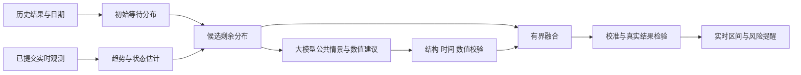

# 历史初估、实时更新与大模型融合

研究日期：2026-10-08。按用户 R34，输入已有号码后先利用历史资料估计，随后随真实叫号趋势更新，大模型参与状态判断和数值融合。这是整体模型设计，仍待训练与回测；rc46已实现[公共特征与候选分布融合组件](DISTRIBUTION_FUSION.md)，rc47增加[有界DeepSeek适配器](DEEPSEEK_ADAPTER.md)，rc48增加[历史经验候选](HISTORY_FUSION.md)，实时候选、真实模型调用和发布链路待验证，不是已训练模型或准确率承诺。当前认证真实结果为 0，`eta_available=false`。已有研究基线、时间顺序回放、日期和观测工具继续复用，见[预测验收](PREDICTION_EVALUATION.md)、[历史基线](HISTORY_BASELINE.md)、[结果特征](OUTCOME_FEATURES.md)。供应商选择见[模型与费用](LLM_MODEL_CHOICES.md)。

## 预测什么

以首次有效叫号为终点，分别建模取号后的总等待、已等待者的剩余等待和未来候选取号时刻的叫号分布。到店、签到、叫号与入座是不同事件。输出中位数、较早／较晚分位点、依据、更新时间、模型版本和校准状态；用户的 `+10/-10` 是目标偏移，与统计误差分开。

已等待 `a` 分钟且尚未叫号时，静态总等待生存函数 `S` 可转换为剩余等待：`P(R>r | T>a)=S(a+r)/S(a)`，只在条件事件真实可确认且分母有足够资料时使用。若模型已直接以“现在、已等待、尚未叫号”为条件训练剩余分布，就不再重复这一转换。输入取号时间未知时保留未知；只靠用户号码不能补造已等时长或确认尚未叫号。

## 四层组成

以下选择属于本项目从资料作出的设计推论，各论文都没有替本项目验证寿司郎业务。

1. **历史层**：先保留同店／同队列／相似日期时段的可解释分布基线；资料稀疏时分层借用城市或相似门店，显示冷启动。候选主模型为区间删失 AFT，输入日期、时段、已等时长、人数桌型和当时可用状态；完整结果足够时再与分位数树比较。XGBoost 官方 AFT 支持精确、区间和右删失结果，适合保留采样造成的时间区间，不能把区间中点伪装真值。[官方教程](https://xgboost.readthedocs.io/en/stable/tutorials/aft_survival_analysis.html)
2. **实时层**：按真实接收时间维护短／中／长观测窗口，联合展示集合变化、原始数量、失败和缺口。先用稳健窗口统计作对照，再评估在线变点方法，判断较快、常态、较慢及资料不足。BOCPD 提供在线运行段长度后验的思路；本项目需另选观测分布、季节先验及截断预算。[Adams 与 MacKay](https://arxiv.org/html/0710.3742v1)
3. **大模型层**：读取公共聚合趋势、历史摘要、已生成的候选分布、日期及有来源的外部事件，计算受限的情景选择、候选权重／修正参数及理由。它确实参与数值更新；个人号码、精确用餐计划和结果原文留在本地。公共位置网格上的候选情景可供同店用户共享，最后结合私人位置在本地计算。
4. **融合与校准层**：候选模型输出完整累计分布 `F_k`，融合 `F(r)=sum(w_k F_k(r))`，其中权重非负、和为 1；从融合后的分布重新取分位点。大模型建议通过范围及一致性校验后，受回测确定的影响上限约束；不把它自报的信心作为校准概率。融合后再检验区间，不能借用某一个子模型的覆盖率。

历史和近期实际等待各有价值。Ibrahim、Whitt 的多服务台研究包含时变到达和弃队，说明近期等待估计也会有滞后；我们需要当前趋势，而不能固定“一号几分钟”。该论文的服务纪律、完整队列和到达率假设没有在寿司郎得到验证，不直接套参数。[作者原论文](https://www.columbia.edu/~ww2040/IbrahimWhitt_DelayEstWithTimeVaryingArrivals.pdf)

## 号码、签到与快速跳号

号码差在同店、同队列、同发号周期及可靠推进锚点成立时是重要特征。保留与每个已展示号码的候选距离、排序／周期可确认情况、历史变化、签到状态和缺失标记；当前有限三位集合不自动成为最后实际叫号游标。没有锚点时，不硬造精确前方桌数。预约与堂食分开，跨周期、前缀不同、返签插回需另处理。

将“号码推进”“实际入座”“真实弃号”拆开。用户举出的两分钟跨大量号码可来自未签到／弃号等情况，但展示变化无法独立识别真实过号率。隐性弃队研究也把未观察到的离队当作测量问题，而不是从界面消失直接作结论；其联系中心数值不能搬到餐厅。[Castellanos 等](https://arxiv.org/abs/2304.11754)

模型可学习较快情景的历史出现时段及实时证据，让较早叫号端及时变化。避免用强平滑掩盖突然提前；先检查当前变化是否跨失败、休眠缺口或号码重置。只有验证过的数值推进才估推进速率；有限集合周转可能饱和，不能从三个位置反推出每分钟处理上百桌。任何大模型结果都不能把未知源更新时间改成已知。

## 大模型计算契约

每份输入至少绑定门店／队列、观测版本、模型版本、允许特征、各响应时刻、资料截止、缺口与质量状态。输出绑定同一输入摘要，包含候选情景ID、非负权重或受限修正、引用的特征ID、资料不足原因、适用期限；不接受自由生成的“实际叫号事件”。

先验证 JSON、精确字段、有限数值、权重总和、可用候选ID、时间顺序和引用依据，再参与融合。输出超时、截断、空内容、算术不一致、版本过旧或证据不足时回退到已验证的数值路径，并记录 AI 本次未参与。DeepSeek JSON 模式本身仍可能空输出，不能代替这些验证。[官方格式说明](https://api-docs.deepseek.com/guides/json_mode/)

实时采集不等待模型回答。每次新观测都可更新本地数值结果；大模型同店共享调用，常态按变化触发／较低频率，临近叫号或异常时可按 30 秒输入版本重新计算，具体上限通过额度和延迟实测确定。设置请求超时、并发去重、日预算和输出 token 上限，不在失败后重复产生无限费用。迟到的 AI 回答不能覆盖较新的预测；收到新资料后说明旧建议是否仍适用。

## 误差与验收

CQR 将分位数估计与校准结合，但其有限样本保证有交换性前提；门店日期变化与同一号单重复更新不自然满足它。自适应 conformal 可研究分布变化下的在线区间调整，长期平均覆盖也不等于每店、每个未来时刻的保证。区间删失、延迟标签和取消的适配需单独验证，不能直接套精确标签算法后宣称90%可靠。[CQR原论文](https://arxiv.org/html/1905.03222v1)、[ACI原论文](https://arxiv.org/html/2106.00170v3)、[在线分布变化研究](https://arxiv.org/abs/2208.08401)

同一号单全部更新属于同一个 episode，训练／校准／测试按时间整组划分。只用预测时已知的结果、日期公告、事件和观测；取消可能是信息性删失或竞争事件，不自动当独立随机删失。报告提前量分组、门店／日型／时段覆盖、误差界、区间宽度、提前叫号漏报、假警报及冷启动不可用比例。对区间标签沿用已有误差上下界，不强行压成一个误差。

在完全相同的时间切分上比较：历史基线、历史＋实时、历史＋实时＋大模型、只生成解释、不参与数值的大模型对照。2024年研究发现若干 LLM 时序方法的收益不足；2026年更大规模研究给出不同的正面结果，设置与规模不同。两者都不能证明我们的小规模实时 API 融合一定更准，应同时量度预测收益、延迟和成本。[Tan等，NeurIPS2024](https://arxiv.org/abs/2406.16964)、[Qiu等，2026预印本](https://arxiv.org/abs/2602.14744)

## 进入实现的顺序

1. 扩店的真实观测继续积累，先验证门店对应、刷新规则和号码条件；当前[六店分批方案](STORE_EXPANSION.md)不等于全国预测。
2. 完成手动号码的私有追踪和正常用餐结果记录；保留“首次被展示”与“实际叫号”的区别。没有真实等待标签时，只能提供研究输出或资料不足。
3. 建立公共实时特征版本和候选分布契约，复用已有时间顺序回放；实现初估、条件剩余及更新，先检验可解释基线。
4. rc47已接入带预算的[DeepSeek适配器](DEEPSEEK_ADAPTER.md)，合成结构与融合验证已做；下一步做真实结构／延迟试验，再用同源结果检验AI数值融合。暂未提供密钥、没有付费请求。
5. 校准区间与风险，接入60／30秒共享采集及真实通知；检验理想时刻反向建议。未来排队变化需要情景预测，不能只将目标减当前平均等待。

研究阅读范围：AFT官方实现说明、BOCPD／CQR／ACI网页方法段及队列论文导论已核对；隐性弃队与两篇LLM论文目前核对摘要、出处和研究设置，尚未复现。全部算法选择、参数、训练及产品误差都要继续实际验证；本文件不声称“完美模型”。

rc48增加[历史区间候选桥接](HISTORY_FUSION.md)，按截止可用的审核记录生成完整次数区间，支持总等待、条件剩余和理想时间网格；CDF融合保留精确分数和不确定上界。当前只生成历史情景，实时情景尚未拟合，单一情景不产生无作用的付费请求；真实结果、误差与在线发布继续验证。

rc49增加[手动已有号私有追踪](MANUAL_TICKET_TRACKING.md)：结合本人声明、当前分队列展示和条件历史分布，单目录锁核对最新版本后原子提交；已展示／后来状态未知请求30秒刷新。当前是后台库与CLI、研究区间；自动轮询编排、同店计划接入、实际模型供应商、提醒与真实误差仍未验收。

rc50另连接[自动追踪后台](TICKET_TRACKING_LOOP.md)：同店投影读取、异步计算、私人新版本优先，以及有期限60／30秒采集需求；独立工作者须显式接入。真实多情景拟合、供应商／费用和有／无AI效果、正常结果校准、通知与用户页面仍待验。原rc49及更早状态为其实现时点，不覆盖历史证据。

rc51加入[相似日期展示变化参考](TREND_PROFILES.md)：不重叠历史窗口按实际可比时长归一化，过滤采样节奏，保留日期／时段回退层级与同值排序区间；四项公共数值特征可进入自动追踪及受限AI输入。这里仍无实时等待候选拟合、真实过号标签或概率校准，不把排序直接换算为等待分钟。

rc52加入[长期日期参考档案](TREND_ARCHIVE.md)：按首次汇入时间筛选完整封存资料，以日期与采样间隔选取均衡窗口，来源统计和选择规则可回查；自动追踪动态重算，同店可共享。没有利用变化率挑选参考、生成真实快慢等待候选或校准风险；正常结果及有／无AI回测继续是上线条件。

rc53新增[实时邻域研究基线](REALTIME_NEIGHBORS.md)：独立episode的相似实时输入生成剩余分布，与history完整CDF融合，自动追踪真实线程已连接；合成测试中实时趋势及AI权重实际改变数值。默认权重／邻域参数尚未回测，真实训练和误差未校准，不能将这一研究拟合称为生产模型完成。
